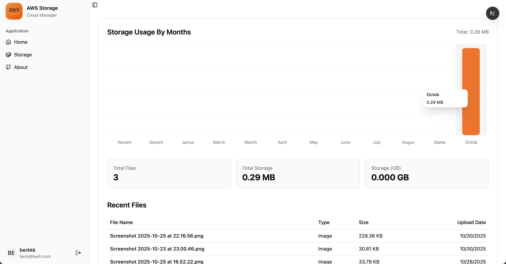
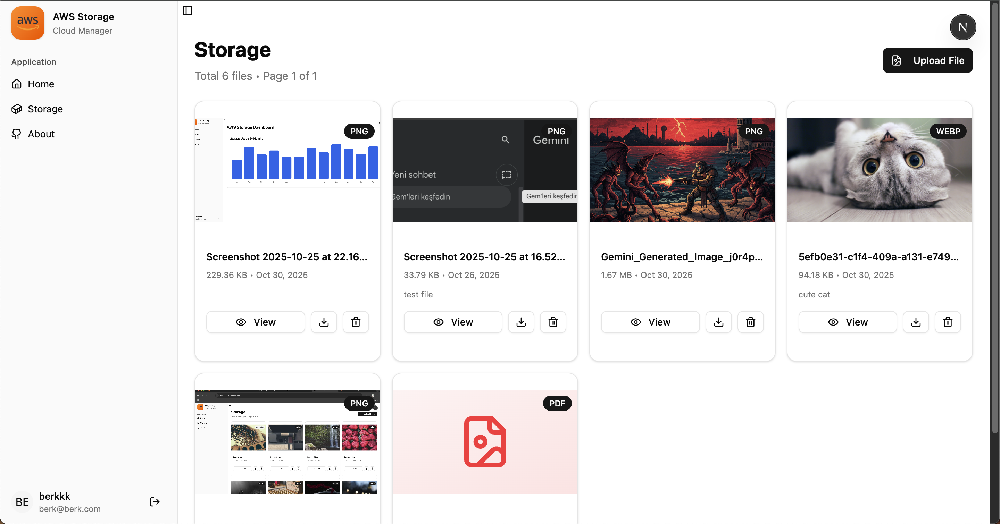
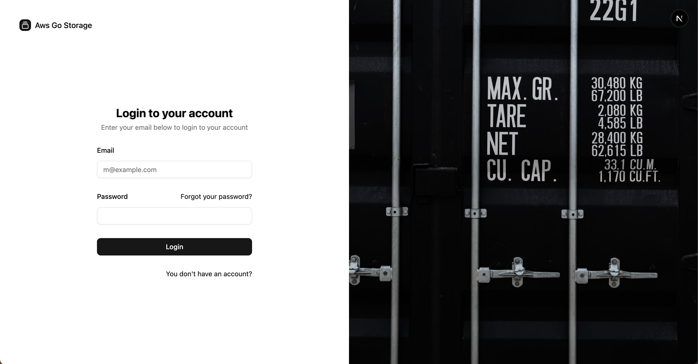

# 🗄️ AwsGo-Storage

**AwsGo-Storage** is a fully Dockerized cloud storage application built with **Go (Gin)** for the backend and **Next.js (ShadCN UI)** for the frontend.  
It allows users to **upload, list, download, and delete files** stored on **AWS S3**, while file metadata and user information are managed via **DynamoDB**.  
The system is designed to run seamlessly on **AWS EC2** (or Lambda) instances.

---

## 🚀 Features

- 🔐 **User Authentication** – Register, login, and profile endpoints  
- ☁️ **File Management** – Upload, list, download, and delete files from S3  
- 🧾 **Metadata Storage** – Store file metadata and user details in DynamoDB  
- 📊 **Dashboard Metrics** – View storage and usage analytics  
- 🐳 **Fully Dockerized** – Ready for containerized deployment  
- ☁️ **AWS-Native Architecture** – Uses EC2, S3, and DynamoDB

---

## 🧱 Tech Stack

### **Backend**
- **Language:** Go (Golang)
- **Framework:** Gin
- **AWS Services:** S3, DynamoDB
- **Auth:** JWT-based authentication
- **Containerization:** Docker
- **Deployment Target:** EC2 or AWS Lambda

### **Frontend**
- **Framework:** Next.js (App Router)
- **UI:** ShadCN/UI + Tailwind CSS
- **API Integration:** Fetch
- **Deployment Target:** AWS EC2 or Vercel

---

## 🧩 API Endpoints

| Method | Endpoint | Description |
|--------|-----------|-------------|
| **GET** | `/health` | Health check endpoint |
| **GET** | `/api/v1/user/:id` | Get user by ID |
| **POST** | `/api/v1/user/register` | Register new user |
| **POST** | `/api/v1/user/login` | Login user |
| **GET** | `/api/v1/user/me` | Get authenticated user profile |
| **POST** | `/api/v1/storage/upload` | Upload file to S3 |
| **GET** | `/api/v1/storage/files` | List user files |
| **GET** | `/api/v1/storage/files/:id/download` | Download file by ID |
| **DELETE** | `/api/v1/storage/files/:id/delete` | Delete file from S3 |
| **GET** | `/api/v1/storage/dashboard` | Get storage dashboard metrics |

---

## 🖼️ Preview Images

